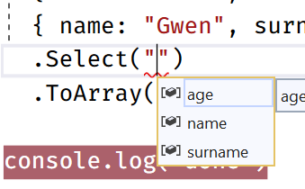

# Emulating Object-Oriented concepts with Functional Programming
_Dr. Giuseppe Maggiore_

In this short article, we discuss how to use some functional programming features of the TypeScript language in order to simulate object-oriented constructs such as information hiding, interfaces, classes, and polymorphism.
We will then move on to exploiting the advanced type system of TypeScript in order to combine functional-style object-oriented programming with very descriptive types, in order to create a state of the art stream processing library.


## Basics
The basic construct that we will emulate is the definition of an interface, plus a class that implements it with some private fields that we absolutely do not want to expose to the outside world.

The interface will be a simple 2D vector, with getters and setters for the `x` and `y` coordinates, a `length` method to compute the length of the vector and a `normalize` method tha returns a new vector with the same direction, but a length of 1:

```ts
type IVector2 = {
  readonly getX: () => number
  readonly getY: () => number
  readonly setX: (_:number) => void
  readonly setY: (_: number) => void
  readonly length: () => number
  readonly normalize: () => IVector2
  readonly toString: () => string
}
```

We now move on to the implementation itself. The implementation is actually hidden behind a single function which acts as the equivalent of a constructor:

```ts
const Vector2 = (x: number, y: number): IVector2 =>
```

The constructor takes as input the parameters for the vector, which are `x` and `y` (both numbers), and returns an instance of `IVector2` around these parameters.

The `IVector2` is a mutable class, meaning that we need to store the data for the fields, the `x` and the `y`, in a separate container. Let's call this container `fields`:

```ts
  let fields = { x: x, y: y }
```

Now we can create the actual instance of the interface:

```ts
  return {
    getX: () => fields.x,
    getY: () => fields.y,
    setX: x => fields.x = x,
    setY: y => fields.y = y,
    length: () => Math.sqrt(fields.x * fields.x + fields.y * fields.y),
    normalize: function (this: IVector2) { return Vector2(fields.x / this.length(), fields.y / this.length()) }
    toString: () => `(${fields.x}, ${fields.y})`
  }
}
```

Notice that the `fields` variable is available inside the various methods, even though it was declared as a local variable inside the `Vector2` constructor function. Normally, local variables cease to exist after the function in which they are declared returns a value (their _stack frame_ gets cleaned up). An exception to this behaviour is that extra functions are created that keep making use of the local variables of the parent _scope_. In this case, these variables that are captured in the so\-called _closure_ of the inner function, will not be cleaned up when the main function returns. Thus, functions such as `getX` and `setX` cause `fields` to not be cleaned up. Moreover, `fields` will act as a permanent storage to which only an instance of `Vector2` can access, but after the function `Vector2` returns, all other references to `fields` will be lost. This makes the content of `fields` effectively *private*.

Using the `Vector2` class is quite simple. We first initialise a new instance of `Vector2` by simply invoking the `Vector2` class, which thus effectively becomes a *constructor*\:

```ts
let v1 = Vector2(5, 3)
```

We can then call methods that will either read or write to the private `fields`\:

```ts
v1.setX(2)
let v2 = v1.normalize()
```

The following program\:

```ts
let v1 = Vector2(5, 3)
const s1 = v1.toString()
v1.setX(2)
const s2 = v1.toString()
let v2 = v1.normalize()
const s3 = v2.toString()
```

would indeed result in the following values\:

| Variable      | Val           |
| ------------- | -------------:|
| `s1`          | "(5, 3)" |
| `s2`          | "(2, 3)" |
| `s3`          | "(0.5547, 0.8321)" |

just as expected.

The full listing for this small program can be found [here](vector2.ts).


## (Polymorphic) streams
We now attempt a more exciting task. We will define a LINQ/Streams like library that supports operations on streams. 

Streams can be seen as revolving around one single basic interface, the `IStream`, which offers a way to enumerate a series of items. Whether these items come from a network, a file, an array, or are computed on the fly, it does not really matter to the stream. The interface(s) that make up the stream are the following\:

```ts
export type IStream<a> = {
  readonly Enumerate: () => IEnumerator<a>
}

export type IEnumerator<a> = {
  readonly Reset: () => void
  readonly MoveNext: () => a | undefined
}
```

The core of the stream is an enumerator, which exposes the next element with the `MoveNext` method. When the end of the stream is reached, the enumerator returns `undefined`. An enumerator may also be `Reset` in order to go back to enumerating the first element.

> Notice that we also define the utility `type Fun<a,b> = (_:a) => b`. I personally prefer to type `Fun<a,b>` instead of `(_:a) => b`, but it is only a matter of preference and (finger) muscle-memory.

We can now define the first concrete stream: an array stream. Following the same pattern as in the previous section, we define a class/constructor `FromArray` that creates an `IStream<a>` from an `Array<a>`:

```ts
export const FromArray = <a>(x: Array<a>): IStream<a> => {
  let fields = { index: 0 }
  return {
    Enumerate: () => ({
      Reset: () => fields.index = 0,
      MoveNext: () => x.length <= fields.index ? undefined : x[fields.index++]
    })
  }
}
```

The created stream, when enumerated, stores the `index` up to which we have already exposed elements in the private fields. When the `index` surpasses the length of the array, we return `undefined` in order to signal that the stream has no more elements to iterate.

The second concrete stream, the _singleton_, simply derives further from the array stream:

```ts
export const Singleton = <a>(x: a): IStream<a> => FromArray([x])
```

We can also define infinite streams that generate the elements on the fly based on a generator function that takes as input the index of the element to generate\:

```ts
export const Infinite = <a>(getItem: Fun<number, a>): IStream<a> => {
  let fields = { index: 0 }
  return {
    Enumerate: () => ({
      Reset: () => fields.index = 0,
      MoveNext: () => getItem(fields.index++)
    })
  }
}
```

We can create streams as follows\:

```ts
let allNumbers = Infinite(x => x)
let people = FromArray(john, jack, joe, diane, sally, rose)
let one = Singleton(1)
```

We can force the enumeration of all the stream elements to a single array, all at once:

```ts
export const ToArray = <a>(stream: IStream<a>): Array<a> => {
  let result = []
  let enumerator = stream.Enumerate()
  let current = enumerator.MoveNext()
  while (current) {
    result.push(current)
    current = enumerator.MoveNext()
  }
  return result
}
```

### Stream transformations
We can transform streams in various ways, in order to programmatically compose streams together, transform their elements, remove elements, and more.

A stream transformer is an instance of the decorator design pattern. It takes as input an instance of `IStream`, and produces (_implements_) a new instance of `IStream` that might contain different elements from the original.

The simplest transformer is `Map`, which applies a given transformation function to each element of a stream. For example, mapping a stream with transformation function `x => x + 1` will produce a new stream where all elements are incremented by one (`[1, 2, 3] => [2, 3, 4]`). `Map` simply invokes `MoveNext` from the underlying stream enumerator, and for each valid (`!= undefined`) element outputs that element transformed by the transformation function:

```ts
export const Map = <a, b>(stream: IStream<a>, f: Fun<a, b>): IStream<b> => {
  return {
    Enumerate: () => {
      let enumerator = stream.Enumerate()
      return {
        Reset: () => enumerator.Reset(),
        MoveNext: () => {
          let current = enumerator.MoveNext()          
          return current ? f(current) : undefined
        }
      }
    }
  }
}
```

A more articulate example is `Where`, which filters elements from a stream depending on a predicate (that is a function which, for each element, checks whether or not the element is accepted in the new stream or not). Similar to `Map`, `Where` also does iterate all elements of the original stream, but it will keep iterating until it either reaches the end of the source stream, or an element for which the predicate returns `true`\:

```ts
export const Where = <a>(stream: IStream<a>, predicate: Fun<a, Boolean>): IStream<a> => {
  return {
    Enumerate: () => {
      let enumerator = stream.Enumerate()
      return {
        Reset: () => enumerator.Reset(),
        MoveNext: () => {
          let current = enumerator.MoveNext()
          while (current && !predicate(current))
            current = enumerator.MoveNext()
          return current
        }
      }
    }
  }
}
```

### "Fluent" syntax
Before our streams are really usable, we should add some methods to the `IStream` interface so that, instead of writing\:

```ts
Map(Where(FromArray([...]), x => x % 2 == 0), x => x * 3)
```

which, frankly, is a bit unreadable, we can write something more left\-to\-right, subject\-to\-predicate that some people (at least accustomed to Western World writing) tend to find easier to read\:

```ts
FromArray([...]).Where(x => x % 2 == 0).Map(x => x * 3)
```

We can obtain this easily, with a little bit of bookkeeping and nothing else. We start by adding the desired methods to the `IStream` interface\:

```ts
export type IStream<a> = {
  readonly Enumerate: () => IEnumerator<a>
  readonly ToArray: () => Array<a>
  readonly Where: (predicate: Fun<a, Boolean>) => IStream<a>
  readonly Map: <b> (f: Fun<a, b>) => IStream<b>
}
```

We now define a function that creates a record with only the common methods we just added\:

```ts
const methods = <a>() => ({
  ToArray: function (this: IStream<a>) { return ToArray(this) },
  Where: function (this: IStream<a>, predicate: Fun<a, Boolean>) { return Where(this, predicate) },
  Map: function <b>(this: IStream<a>, f: Fun<a, b>) { return Map(this, f) }
})
```

These methods can be defined generically, as they will only invoke the functions we defined previously. We could also elect to move the implementation of these functions to `methods` itself, but that is a question of taste. I would advise to do so, in order to avoid cluttering the global namespace of this module, but like many things in life YMMV.

Finally, we use the spread operator to copy the `methods()` record into the various instances of `IStream`, for example\:

```ts
export const FromArray = <a>(x: Array<a>): IStream<a> => {
  let fields = { index: 0 }
  return {
    Enumerate: () => ({
      Reset: () => fields.index = 0,
      MoveNext: () => x.length <= fields.index ? undefined : x[fields.index++]
    }),
    ...methods()
  }
}
```

We do the same for `Where` and `Map` as well. Thankfully the compiler will guide us along this process by signaling that the implementations of `Where` and `Map` are missing the new methods, so we cannot really miss the issue.

Et voilá\: we can now invoke the various methods in a "linear" format that makes reading easier\:

```ts
let numbers = FromArray([1, 2, 3, 4, 5, 6])
  .Where(x => x % 2 == 0)
  .Map(x => x * 3)
  .ToArray()
```

The full listing for this basic stream library can be found [here](streams.ts).


### Advanced typing and streams
We can extend our streams library with some advanced typing, in order to do something that is (currently) impossible to guarantee statically (thus at compile\-time) with languages such as C\# and Java. We want to be able to define SQL-style selector operations where the compiler guarantees that we are not trying to select a field that does not exist, and where the resulting type is generated for us by the compiler.

> Note that this feature can be partially implemented by C\# language functionality such as anonymous types. This said, anonymous types are very limited, and are an "isolated" area of the typesystem of the language. The functionality that we will use in the following is much more general than its C\# cousin, and as such we suffer from no restrictions such as "anonymous types cannot be returned by a function".

Let us define a new method, `Select`, in the `IStream` interface. We want to specify that we can only select fields of the elements of the stream. We do this by stating that the parameter of `Select` must be an array of `key` values, where `key` is a generic argument that must respect the generic constraint ` key extends keyof a
`, that is `key` is the type of one or more fields of `a`.

```ts
  readonly Select : <key extends keyof a>(...keys: key[]) => IStream<Pick<a, key>>
```

> `Pick<t, k>` is a standard library type that selects only the keys `k` from `t`. For example, `Pick<{ x: number, y: string, z: boolean }, "x" | "z"> = { x: number, z: boolean }`.
> Notice that, while `Pick` is very handy, it can also be defined with advanced type combinators directly, so it is not a builtin primitive!

The implementation of `Select` is essentially the very same implementation of `Map`, but instead of invoking the transformation function for each element, we extract the `key` values into a new result\:

```ts
const Select = <a, key extends keyof a>(stream: IStream<a>, ...keys: key[]) => {
  return {
    Enumerate: () => {
      let enumerator = stream.Enumerate()
      return {
        Reset: () => enumerator.Reset(),
        MoveNext: () => {
          let current = enumerator.MoveNext()
          let result: any = {}
          if (current == undefined) return undefined
          for (let i = 0; i < keys.length; i++) result[keys[i]] = current[keys[i]]
          return result as Pick<a,key>
        }
      }
    },
    ...methods<a>()
  }  
}
```

> Unfortunately, TypeScript requires one last cast of the result to `Pick<a,key>` in order to understand that the program might compile. Hopefully we will get to a better and better type system that does not require even such a minor hack at some point, but one should appreciate the intelligence of TypeScript's type system already!

We can now use the new operator as follows\:

```ts
let people = FromArray([
  { name: "John", surname: "Doe", age:27 },
  { name: "Jane", surname: "Red", age: 11 },
  { name: "Jill", surname: "Miller", age: 39 },
  { name: "Rick", surname: "Muller", age: 72 },
  { name: "Ross", surname: "Franken", age: 57 },
  { name: "Rose", surname: "Rossi", age: 35 },
  { name: "Gwen", surname: "Antonio", age: 21 }])
  .Select("name", "surname")
  .ToArray()
```

The type of the result will be\:

```ts
people:Array<{ name:string, surname:string }>
```

while the value of the result will be\:

```ts
[{name: "John", surname: "Doe"}
 {name: "Jane", surname: "Red"}
 {name: "Jill", surname: "Miller"}
 {name: "Rick", surname: "Muller"}
 {name: "Ross", surname: "Franken"}
 {name: "Rose", surname: "Rossi"}
 {name: "Gwen", surname: "Antonio"}]
```

Exactly as expected. We could further perform operations such a:

```ts
let people = FromArray([
  { name: "John", surname: "Doe", age:27 },
  { name: "Jane", surname: "Red", age: 11 },
  { name: "Jill", surname: "Miller", age: 39 },
  { name: "Rick", surname: "Muller", age: 72 },
  { name: "Ross", surname: "Franken", age: 57 },
  { name: "Rose", surname: "Rossi", age: 35 },
  { name: "Gwen", surname: "Antonio", age: 21 }])
  .Select("age")
  .ToArray()
```

which, as expected, would extract the array of ages. It is nice to notice that Visual Studio can offer us auto\-completion thanks to the type definitions, as seen in the following screenshot\:



# Conclusion
In this article we have seen how to implement the definition of object-oriented constructs into functional programming in TypeScript.
We have seen that we can combine these functional constructs with advanced types in TypeScript, thereby obtaining very precise types around our classes and interfaces.

This exercise is useful from a special perspective in my opinion. There is always something to discover ("make things as simple as they can be, but no simpler") when challenging language constructs such as objects, classes, and inheritance by implementing them through simpler constructs such as records and functions. By decomposing a more complex construct and rebuilding it with simpler tools we attain a deeper understanding and more control: nobody stops us now from defining classes where the methods themselves can be "hot-swapped" at run-time, or even go crazier with new variations of polymorphism that do not fully conform to the traditional wisdom around object orientation.

# About the author
Giuseppe Maggiore holds a PhD in Computer Science and is now currently lecturer in Computer Science at the University of Applied Sciences in Rotterdam, CTO of Hoppinger (digital transformation partner), and co-owner of Vidda Digital (fullservice webdevelopment agency).

If you like this way of programming, and would like to get to know (or even [work with](https://www.hoppinger.com/vacatures/)!) more like-minded people, do not hesitate [get in touch](https://www.hoppinger.com/contact/) with us.
